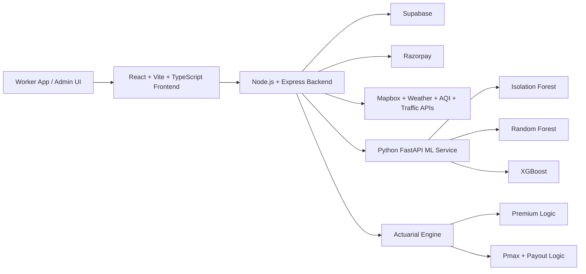

# Nexus Sovereign

AI-driven parametric protection infrastructure for gig and delivery workers.

Nexus Sovereign is a full-stack platform that models income disruption risk for workers on grocery, food delivery, and e-commerce platforms, then turns verified disruption signals into policy activation, claims intelligence, and zero-touch payout workflows.

- Live app: https://nexus-sovereign.onrender.com
- Repository: https://github.com/RandomAssassin-rgb/nexus-sovereign
- Recommended deployment: single-service Render Web Service

> This repository is a production-style prototype for parametric insurance workflows. It demonstrates identity verification, live risk interpretation, premium logic, claims handling, and automated payout orchestration. It is not legal, financial, or underwriting advice.

## Table of Contents

- [Executive Summary](#executive-summary)
- [Market Problem](#market-problem)
- [Solution Overview](#solution-overview)
- [Enterprise Value Proposition](#enterprise-value-proposition)
- [Commercial Model](#commercial-model)
- [Strategic Differentiators](#strategic-differentiators)
- [Core User Flows](#core-user-flows)
- [System Architecture](#system-architecture)
- [Machine Learning Layer](#machine-learning-layer)
- [Actuarial Engine](#actuarial-engine)
- [Claims Architecture](#claims-architecture)
- [Tech Stack](#tech-stack)
- [Repository Structure](#repository-structure)
- [Getting Started](#getting-started)
- [Environment Variables](#environment-variables)
- [Available Scripts](#available-scripts)
- [Deployment Notes](#deployment-notes)
- [API Surface Overview](#api-surface-overview)
- [Current Status And Limitations](#current-status-and-limitations)
- [Roadmap And Expansion](#roadmap-and-expansion)

## Executive Summary

Nexus Sovereign is an AI-driven parametric protection platform built for gig and delivery workers whose earnings are directly exposed to weather, mobility, civic, and platform disruptions.

From an enterprise and investor perspective, the platform sits at the intersection of climate resilience, embedded insurance, operational risk intelligence, and income protection infrastructure. It is designed as a software and decisioning layer that can help insurers, MGAs, gig platforms, and ecosystem partners move from slow, document-heavy claims handling toward automated, signal-based protection workflows.

The core thesis is simple:

1. Identify and verify the worker digitally.
2. Continuously interpret live disruption conditions around that worker.
3. Translate risk into dynamic pricing and coverage logic.
4. Trigger claim decisions and payouts with minimal manual intervention.
5. Give carriers and operators a system that is more scalable, auditable, and operationally responsive than legacy claims infrastructure.

The result is a production-style prototype of parametric insurance infrastructure for the gig economy, with clear enterprise applications in distribution, underwriting support, operational resilience, and claims automation.

## Market Problem

Gig workers experience income shocks in real time, but most protection products still operate on delayed, manual, and generic assumptions.

Heavy rain, floods, severe AQI, heat waves, civic disruption, route shutdowns, and platform outages can materially reduce earnings within hours. Traditional insurance products are not optimized for this cadence. They generally rely on post-event paperwork, broad geographic assumptions, and lengthy claims review processes that create friction precisely when workers are most vulnerable.

For insurers and partners, this also creates an enterprise inefficiency problem:

- claims operations become expensive to scale
- fraud review becomes harder in loosely structured systems
- pricing is often disconnected from live operational risk
- high-frequency, low-ticket events become difficult to service economically
- protection products struggle to align with modern platform labor models

Nexus Sovereign addresses that gap by making disruption-aware, data-backed, and partially automated protection workflows possible.

## Solution Overview

Nexus Sovereign combines worker-facing product flows with enterprise-facing operating infrastructure.

On the worker side, it provides:

- platform-linked onboarding and account creation
- password and biometric-enhanced verification
- coverage selection and premium activation
- live policy state and coverage visibility
- claims submission, dispute handling, and payout notifications

On the enterprise side, it provides:

- risk-aware premium logic
- geospatial disruption interpretation
- admin simulation tooling
- claims orchestration layers
- payout governance logic
- operational dashboards for oversight and intervention

The platform supports worker-facing and admin-facing experiences inside one codebase and one deployment model.

## Enterprise Value Proposition

Nexus Sovereign is positioned as more than a consumer app. It is intended as an enterprise-grade operating layer for organizations that want to build, distribute, or manage protection products for gig workers.

### For Insurers And MGAs

- lower-cost servicing for high-frequency micro-claims
- a path toward parametric or hybrid-parametric product design
- better explainability through explicit pricing and payout logic
- stronger risk segmentation via live environmental and mobility signals

### For Gig Platforms And Distribution Partners

- worker protection as a retention and trust lever
- embedded protection flows inside existing worker journeys
- operational resilience tooling during weather and disruption events
- a more modern claims experience without building the stack from scratch

### For Investors

- exposure to embedded insurance and climate-risk infrastructure
- recurring platform value through pricing, verification, and claims automation
- a data advantage that compounds through worker, geography, disruption, and payout histories
- optional monetization across software, distribution, and protection operations

## Commercial Model

Nexus Sovereign is currently a working prototype, but the commercial pathways are intentionally legible.

Potential monetization models include:

- SaaS licensing for insurers, TPAs, or gig platforms
- per-policy or per-active-worker platform fees
- revenue share on distributed protection products
- claims automation and decisioning infrastructure fees
- enterprise analytics and operational dashboard subscriptions

The architecture also supports a B2B2C distribution model where carriers, employers, platforms, or ecosystem partners can underwrite or distribute the protection layer while workers interact with a simplified digital product surface.

## Strategic Differentiators

Nexus Sovereign is differentiated by the way it combines software infrastructure, decisioning logic, and operational risk interpretation.

### 1. Hybrid Intelligence Stack

The platform does not depend on a single black-box model. It combines:

- live signal ingestion
- deterministic actuarial rules
- ML-assisted scoring
- explicit payout controls

This makes the system easier to reason about, evolve, and defend in enterprise settings.

### 2. Hyperlocal Risk Representation

By using H3 geospatial indexing, the platform can reason about disruption exposure at a much more granular level than static city-wide assumptions.

### 3. Zero-Touch Payout Design

The payout engine is built around real event triggers, earnings assumptions, replacement logic, and a reserve-aware Pmax circuit breaker. This creates a much stronger operating narrative than simple "demo payouts" with no solvency logic.

### 4. Identity And Fraud Resistance

The product includes password, biometric, and face-based verification flows and is designed to grow toward stronger anti-fraud and device-trust guarantees over time.

### 5. Deployment Flexibility

The repo can be run locally in Vercel-style API mode, but it is also deployable as a single-service full-stack app, which makes real-world demos and enterprise pilots far easier to operate.

## Core User Flows

### 1. Worker Onboarding

Workers can:

- select their platform
- create a linked identity
- register through manual platform credentials
- verify mobile identity
- complete face-based biometric onboarding

### 2. Coverage Activation

After identity setup, workers can:

- review policy coverage
- see location-aware coverage logic
- view premium pricing
- activate a plan via Razorpay-backed payment flows

### 3. Live Protection

Once enrolled, the app surfaces:

- active policy state
- coverage geography
- disruption categories
- premium cycle
- payout limits

### 4. Claims And Payouts

The claims system supports:

- autonomous claims for highly confident triggers
- assisted workflows for uncertain or partially verified events
- disputed flows where additional evidence is uploaded and reviewed

### 5. Admin Command Center

Admins can:

- authenticate separately from worker accounts
- review riders and operational metrics
- inspect risk data
- simulate disruption scenarios
- monitor claims and payouts

## System Architecture

Nexus Sovereign includes both a Vercel-style `api/` directory and a consolidated Express server in `server_dev.ts`.

For local development and Vercel emulation, the `api/` tree is useful.

For the most complete all-in-one deployment path, the Express server is the most practical route because it serves:

- the production web app from `dist/`
- API endpoints
- integration logic
- payout and claims orchestration
- the Python ML sidecar used by the app

### Architecture Diagram



### Frontend

The frontend is built with:

- React 19
- Vite
- TypeScript
- React Router
- Motion / Framer Motion
- Mapbox

Primary UI areas include:

- splash and onboarding
- platform selection
- identity verification
- coverage dashboard
- claims and payouts
- wallet flows
- admin command center

### Backend

The backend is built with:

- Node.js
- Express
- TypeScript via `tsx`
- Supabase client integrations
- JWT-based flows
- WebAuthn libraries
- Razorpay integrations

It coordinates:

- auth and profile workflows
- payouts and claims
- premium activation
- admin simulations
- geospatial and external signal ingestion
- live API aggregation

### Geospatial Intelligence

The platform uses `h3-js` to work with Uber H3 spatial indexing. This enables hyperlocal risk representation beyond coarse city-level zoning and supports map-oriented risk logic.

### Production Serving Model

In production mode, `server_dev.ts` serves the built Vite app from `dist/` and exposes the backend routes from the same process. This is why a single Render Web Service works well for the full stack deployment.

## Machine Learning Layer

Nexus Sovereign includes a Python FastAPI microservice exposed through `ml_service.py` and implemented by `api/ml/main.py`.

### Loaded Model Artifacts

The current ML service loads:

| Model | Artifact | Role |
| --- | --- | --- |
| Isolation Forest | `api/ml/models/isolation_forest.pkl` | anomaly-oriented signal analysis |
| Random Forest | `api/ml/models/random_forest.pkl` | risk and fraud-style classification experiments |
| XGBoost Booster | `api/ml/models/xgboost_premium.json` | premium-oriented scoring artifact |

### ML Endpoints

The service exposes:

- `/predict/oracle`
- `/predict/fraud`
- `/predict/risk`
- `/predict/premium`
- `/health`

### Important Note

This is a prototype-grade ML service, not a finished production underwriting engine. The model artifacts are loaded and the prediction endpoints are wired into the backend, but some returned scores are intentionally simplified for demo reliability and iterative experimentation. The architecture is designed so richer feature pipelines and stricter model inference can be layered in without changing the product surface area.

## Actuarial Engine

One of the strongest parts of the codebase is the deterministic actuarial layer implemented in [`src/lib/actuarial.ts`](src/lib/actuarial.ts) and mirrored for backend compatibility in [`api/_lib/actuarial.ts`](api/_lib/actuarial.ts).

### Weekly Premium Logic

Premiums are computed from:

- worker persona group
- trust score
- risk tier
- season
- disruption context

The pricing model currently encodes:

- a minimum premium floor of `29`
- a maximum premium ceiling of `99`
- a common operating band of `45` to `75`
- persona-specific curves for Blinkit / Zepto, Swiggy / Zomato, and Amazon / Flipkart groups

### Zero-Touch Payout Logic

Payouts are calculated from:

- persona-specific hourly earning tiers
- trigger-specific loss percentages
- disruption duration profiles
- a `70%` income replacement ratio
- a reserve-aware circuit breaker

### Pmax Circuit Breaker

The reserve protection formula used by the app is:

```text
P_payout = min(calculated_payout, (B_res * 0.15 / N_active) * T_w)
```

Where:

- `B_res` is reserve pool balance
- `N_active` is active worker count
- `T_w` is trigger weight

This keeps the payout layer financially realistic during mass events and prevents reserve exhaustion from unchecked autonomous triggers.

## Claims Architecture

The product uses a three-tier claims model.

### Tier 1: Autonomous

- claims can be approved from highly confident risk signals
- built for low-friction, near-instant worker support

### Tier 2: Assisted

- supports events where evidence exists but confidence is not high enough for immediate autonomous approval
- worker or system supplies additional details

### Tier 3: Disputed

- worker challenges or escalates a rejected or insufficiently verified claim
- additional evidence can be uploaded
- intended for human or higher-confidence review paths

This architecture lets the platform handle both fully automated and contested scenarios without forcing every case through the same manual process.

## Tech Stack

### Frontend

- React
- Vite
- TypeScript
- React Router DOM
- Motion / Framer Motion
- Mapbox GL
- Tailwind CSS utilities

### Backend

- Node.js
- Express
- TypeScript via `tsx`
- Axios
- JWT
- bcryptjs
- WebAuthn libraries

### Data And Infra

- Supabase
- Razorpay
- H3 geospatial indexing

### ML And Analytics

- Python
- FastAPI
- scikit-learn
- XGBoost
- NumPy
- pandas
- joblib

### External Signals

- OpenWeather
- WAQI / AQI source
- HERE Traffic
- News / search augmentation hooks
- OpenRouter-backed AI flows

## Repository Structure

```text
.
|-- api/
|   |-- _lib/                 # shared server-side helpers
|   |-- actuarial/            # pricing / reserve endpoints
|   |-- admin/                # admin auth, stats, simulations
|   |-- ai/                   # AI-backed risk insights
|   |-- auth/                 # worker/admin auth and profile endpoints
|   |-- claims/               # claim creation and dispute flows
|   |-- cron/                 # scheduled simulation / predictive jobs
|   |-- ml/                   # FastAPI-facing model artifacts and handlers
|   |-- premium/              # premium activation
|   |-- razorpay/             # payment and subscription endpoints
|   |-- user/                 # sync, location, payment methods, plans
|   |-- verify/               # multivariate claim verification
|   `-- wallet/               # wallet update flows
|-- public/                   # static assets
|-- src/
|   |-- components/           # shared UI components
|   |-- lib/                  # frontend utilities, actuarial logic, stores
|   `-- screens/              # worker and admin screens
|-- ml_service.py             # Python microservice entrypoint
|-- server_dev.ts             # all-in-one Express server
|-- package.json
`-- README.md
```

## Getting Started

### Prerequisites

- Node.js `20.x`
- npm
- Python `3.10+`
- pip

Install Python dependencies for the ML microservice:

```bash
pip install -r api/ml/requirements.txt
```

Install Node dependencies:

```bash
npm install
```

### Configure Environment Variables

Copy the example file and fill in values:

```bash
cp .env.example .env.local
```

On Windows PowerShell:

```powershell
Copy-Item .env.example .env.local
```

### Local Development Options

#### Option A: Vercel-style local API emulation

Use this when you want to test the Vercel-oriented `api/` tree:

```bash
npm run dev:vercel
```

Then in another terminal:

```bash
npm run dev
```

The frontend proxies `/api` to `http://localhost:3000` by default.

#### Option B: Full-stack Express mode

Use this when you want the most complete local runtime in one server process:

```bash
npm run dev:server
```

This route:

- serves the frontend
- exposes backend endpoints
- starts the local Python ML service

### Production Build

```bash
npm run build
```

### Production Start

```bash
npm run start
```

## Environment Variables

The app uses both frontend-prefixed `VITE_` variables and backend-only runtime variables.

### Required For Core Platform

| Variable | Required | Scope | Purpose |
| --- | --- | --- | --- |
| `VITE_SUPABASE_URL` | Yes | frontend + backend | Supabase project URL |
| `VITE_SUPABASE_ANON_KEY` | Yes | frontend | Supabase anon key for client use |
| `SUPABASE_SERVICE_ROLE_KEY` | Yes | backend | privileged Supabase access for server workflows |
| `SUPABASE_JWT_SECRET` | Recommended | backend | JWT signing / verification flows |

### Payments

| Variable | Required | Scope | Purpose |
| --- | --- | --- | --- |
| `RAZORPAY_KEY_ID` | If using payments | backend | Razorpay server-side key id |
| `RAZORPAY_KEY_SECRET` | If using payments | backend | Razorpay server-side secret |
| `VITE_RAZORPAY_KEY_ID` | If using frontend checkout | frontend | client-facing Razorpay key id |
| `RAZORPAY_PLAN_ID` | Optional | backend | subscription plan support |

### Maps And Live Risk Signals

| Variable | Required | Scope | Purpose |
| --- | --- | --- | --- |
| `VITE_MAPBOX_TOKEN` | Recommended | frontend | map rendering |
| `VITE_OPENWEATHER_API_KEY` | Optional | frontend + server runtime | weather lookup support in the current implementation |
| `AQI_TOKEN` | Optional | backend | AQI risk signal |
| `HERE_TRAFFIC_API_KEY` | Optional | backend | traffic risk signal |

### AI / Intelligence

| Variable | Required | Scope | Purpose |
| --- | --- | --- | --- |
| `OPENROUTER_API_KEY` | Optional | backend | AI-backed claim / risk flows |
| `VITE_OPENROUTER_API_KEY` | Optional | frontend | client AI flows where configured |
| `NEWSDATA_API_KEY` | Optional | backend | disruption/news enrichment |
| `JUSTSERP_API_KEY` | Optional | backend | search enrichment |
| `PYTHON_ML_URL` | Optional | backend | used by some serverless routes to override the ML service URL |
| `ML_SERVICE_TOKEN` | Optional | backend | future internal ML auth |

### Local Development Only

| Variable | Required | Scope | Purpose |
| --- | --- | --- | --- |
| `VITE_API_PROXY_TARGET` | Local only | frontend dev | Vite proxy target |
| `VITE_FACE_MATCH_THRESHOLD` | Optional | frontend | biometric tolerance tuning |

### Platform Variables

These are usually provided by the host:

- `PORT`
- `NODE_ENV`
- `SUPABASE_URL` as an alternative backend alias in some deployments

## Available Scripts

| Script | What it does |
| --- | --- |
| `npm run dev` | starts the Vite frontend |
| `npm run dev:vercel` | starts local Vercel emulation for the `api/` tree |
| `npm run dev:server` | starts the all-in-one Express server |
| `npm run build` | creates the production frontend build |
| `npm run start` | starts the production server |
| `npm run preview` | previews the built Vite app |
| `npm run lint` | runs TypeScript type checking |

## Deployment Notes

### Recommended: Render Web Service

This is the cleanest full-stack deployment path for the current repo.

Use:

- Build command: `npm run build`
- Start command: `npm run start`

Why this works well:

- the Express server serves both frontend and backend
- production mode serves `dist/`
- the API surface is much larger than what Vercel Hobby allows comfortably

### Vercel

This repo can run on Vercel, but there is an important caveat:

- the current `api/` surface is much larger than the Vercel Hobby limit for created functions per deployment

Practical implication:

- Vercel Pro is the straightforward option
- or the API tree must be consolidated into far fewer entry files

### Netlify

Netlify can host the frontend static build, but the app is backend-heavy.

If using Netlify:

- add SPA redirects for client-side routing
- host the backend separately
- proxy `/api/*` to that backend

## API Surface Overview

The repository contains route groups for:

- `auth`
- `admin`
- `claims`
- `user`
- `wallet`
- `premium`
- `razorpay`
- `verify`
- `actuarial`
- `ai`
- `cron`
- `ml`

The Express server currently exposes more than 60 API endpoints across these domains.

## Current Status And Limitations

Nexus Sovereign is a substantial working prototype, but a few areas should be understood clearly:

- the ML service architecture is real, but some response paths are simplified for demo reliability
- external integrations degrade depending on available API keys
- real-world production insurance workflows would require stronger compliance, auditability, legal review, and carrier integration
- biometric and identity workflows are implemented as product flows, but enterprise-grade verification and secure enclave guarantees would require additional hardening

## Roadmap And Expansion

### Enterprise Expansion

- deepen insurer, MGA, and platform-facing dashboards
- add stronger carrier controls, reserve analytics, and approval governance
- improve auditability, explainability, and compliance-readiness for enterprise pilots
- support broader partnership models across distribution, claims servicing, and embedded protection

### Product Expansion

- expand coverage logic across more worker categories and platform types
- improve fraud resistance and multivariate verification
- strengthen evidence scoring and dispute explainability
- add more configurable coverage products, riders, and employer-sponsored protection options

### Platform Expansion

- preserve the current PWA experience for lightweight distribution
- launch an Android app using CapacitorJS while reusing the React codebase wherever possible
- maintain both the mobile app and PWA in parallel to keep the product cross-platform
- use native device capabilities for camera access, biometrics, notifications, secure storage, permissions, and location-aware workflows

### Intelligence Expansion

- build richer feature pipelines for the ML microservice
- improve score transparency for underwriting and claims interpretation
- deepen live-risk fusion across environmental, mobility, and platform signals
- strengthen payout confidence scoring and event validation quality over time

### Demo Preview
https://nexus-sovereign.onrender.com


---

If you are using this project for judging, review, or collaboration and want a guided walkthrough, start with the worker onboarding flow, then test coverage activation, zero-touch payout simulation, claims review, and the admin dashboard.

